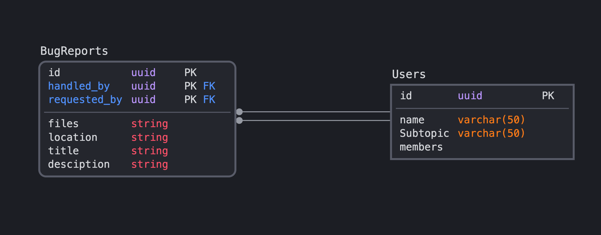

# BugReport

This project is a serverless Lambda application.

## Purpose

`primary` is to retrive information from our `Airtable bugReport`, and keep our `BugReportDB` up to date with its latest
info.    
`secondary` purpose is to analyse incoming reports database, and help point out statistical progress evaluations Current

### Structure

> __Set Environments__  
> we have 2 initiated environments with conected `CodeStar` and `CodePipeline`
> - prod
    >
- Production _ENV_

> - beta
    >
- tenting _ENV_

> __Files and folders:__
> - src - Code for the application's Lambda function.
> - events - Invocation events that you can use to invoke the function.
> - \_\_tests__ - Unit tests for the application code.
> - bug_report_template.yml - A SAM template that defines the application's AWS resources.
> - template.yml - A SAM template that defines the application's AWS `ApiGateway` resources.
> - buildspec.yml - A build specification file that tells AWS CodeBuild how to create a deployment package for the function.

#### Pipeline

- This Lambda application includes two AWS CloudFormation stacks. The first stack creates the pipeline that builds and
  deploys your application.

- The pipeline creates a second stack that contains your application's resources, including Lambda functions, an API
  Gateway API, and Amazon DynamoDB tables. These resources are defined in the `template.yml` file in this project. You
  can update the template to add AWS resources through the same deployment process that updates your application code.
  You can view those resources in the **Resources** section of the application overview in the Lambda console.
